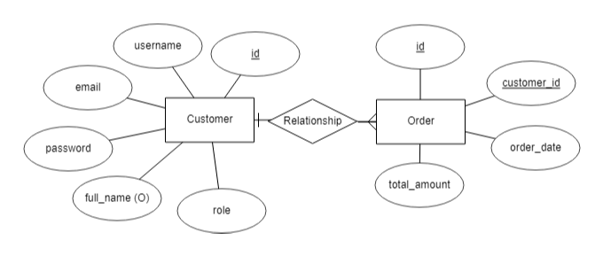

# RESTful API UStore with Gin-Golang

Berikut adalah ERD dan table database spesifikasi yang digunakan pada RESTful API UStore dengan Gin-Golang:

### Entity Relationship Diagram:

### Tabel `customer`:

- **id** (INT, Primary Key, Auto Increment)
  - Identifikasi unik untuk setiap pengguna.
- **username** (VARCHAR(255), NOT NULL)
  - Nama pengguna unik untuk masuk ke sistem.
- **password** (VARCHAR(255), NOT NULL)
  - Kata sandi pengguna yang dienkripsi atau di-hash.
- **email** (VARCHAR(255), NOT NULL)
  - Alamat email pengguna.
- **full_name** (VARCHAR(255))
  - Nama lengkap dari pengguna.
- **role** (ENUM('admin', 'customer'), NOT NULL)
  - Peran pengguna, bisa menjadi admin atau customer.

### Tabel `order`:

- **id** (INT, Primary Key, Auto Increment)
  - Identifikasi unik untuk setiap pesanan.
- **customer_id** (INT, Foreign Key)
  - Menghubungkan ke tabel `customer` untuk menetapkan hubungan antara pesanan dan pelanggan.
- **order_date** (DATE, NOT NULL)
  - Tanggal pesanan dibuat.
- **total_amount** (DECIMAL(10, 2), NOT NULL)
  - Jumlah total pesanan.

## Cara Instalasi (tanpa Docker):

- Clone repository
- Jalankan perintah `go mod tidy` untuk mendownload semua dependency yang dibutuhkan
- Buat database dengan nama `dbustore` di MySQL
- Jalankan perintah `go run main.go` untuk menjalankan server
- Server akan berjalan di `localhost:8000`

## Cara Instalasi (dengan Docker):

- Clone repository
- Jalankan perintah `docker-compose up --build` untuk menjalankan server
- Server akan berjalan di `localhost:8000`